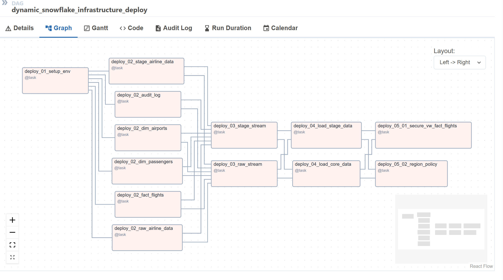
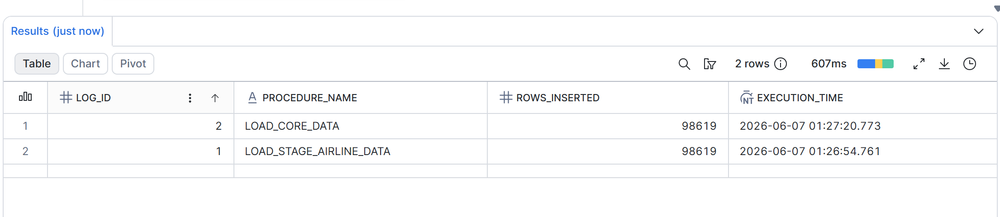

# Snowflake & Airflow ETL Pipeline: Airline Data Warehouse

## 1. Project Overview
This project demonstrates a fully automated, scalable, and secure Data Warehouse (DWH) built on **Snowflake** and orchestrated by **Apache Airflow**. The pipeline processes airline flight data, transforming raw CSV files into a structured Star Schema ready for BI analytics.

## 2. Architecture & Data Layers
The project follows a multi-tier DWH architecture (Medallion-like approach):

* **a) RAW Layer (Landing Zone):** Data is ingested via `COPY INTO` from an Internal Stage. All columns are initially stored as `VARCHAR` to prevent load failures.
* **b) STAGE Layer (Cleansing):** Data types are enforced (e.g., casting strings to `INT` and `DATE`). Null handling and data formatting are applied.
* **c) CORE Layer (Star Schema):** - **Dimensions:** `DIM_PASSENGERS`, `DIM_AIRPORTS` with auto-incrementing Surrogate Keys (SK).
   - **Facts:** `FACT_FLIGHTS` tying dimensions together for fast analytical queries.
   - **Audit:** `AUDIT_LOG` table tracking procedure executions and row counts.

## 3. Key Data Engineering Features Implemented

* **a) Change Data Capture (CDC):** Utilized Snowflake Streams (`RAW_AIRLINE_STREAM`, `STAGE_AIRLINE_STREAM`) to process only incremental data (deltas), significantly reducing compute costs and preventing duplicate processing.
* **b) Idempotent Data Loading:** Implemented ANSI SQL `MERGE` statements (Upserts) in the CORE layer to ensure duplicate records are ignored and dimensions maintain uniqueness.
* **c) Transaction Control:** Wrapped multi-table inserts in the CORE procedure with `BEGIN TRANSACTION` and `COMMIT` blocks to ensure data consistency and prevent stream premature consumption.
* **d) Row-Level Security (RLS):** Implemented a `ROW ACCESS POLICY` combined with a `SECURE VIEW`. For example, users with the `EU_ANALYST` role can only view flights arriving in Europe.
* **e) Time Travel:** Demonstrated data recovery scenarios using Snowflake's CLONE and AT (OFFSET => -X) to restore deleted records without relying on traditional backups. (Testing scripts are preserved in the sql/99_testing/ directory for reference).

## 4. Technology Stack
* **Database:** Snowflake (SQL, Stored Procedures, Streams, RLS, Time Travel)
* **Orchestration:** Apache Airflow (Python, TaskFlow API, SnowflakeHook, Dynamic DAGs)
* **Architecture Concept:** Infrastructure as Code (IaC)

## 5. Orchestration (Dynamic Airflow DAG)
The infrastructure deployment and ETL orchestration are fully automated using Airflow's **TaskFlow API**. 

Instead of hardcoded tasks, the project utilizes a **Dynamic DAG**:
1. The Python script dynamically parses the `sql/` directory.
2. It generates tasks on-the-fly for every SQL file using the `@task` decorator and `SnowflakeHook`.
3. Dependencies are automatically built based on folder hierarchy (`01_infrastructure` >> `02_tables` >> `03_streams` >> `04_procedures` >> `05_security`).
This modular **Infrastructure as Code** approach ensures scalability and prevents merge conflicts during team development.
---

## 6. Manual Testing & Validation
While the infrastructure (DDL) is deployed automatically via Airflow, the data manipulation (DML) and feature validation are handled manually for demonstration purposes. 

A comprehensive testing suite is located in the `sql/99_testing/manual_tests.sql` file. This script includes commands to:
* Simulate initial data ingestion (`COPY INTO`).
* Trigger the ETL pipeline manually (`CALL` stored procedures).
* Verify CDC streams and review Audit Logs.
* Demonstrate Data Recovery via Snowflake Time Travel.
* Validate Row-Level Security (RLS) by switching user roles.

---

## 7. Project Screenshots

**Airflow Dynamic DAG Execution:**

**Snowflake Audit Log:**
